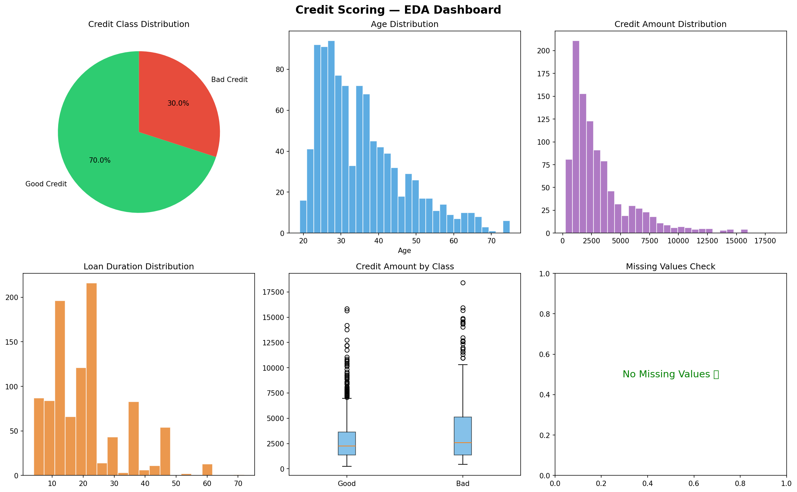
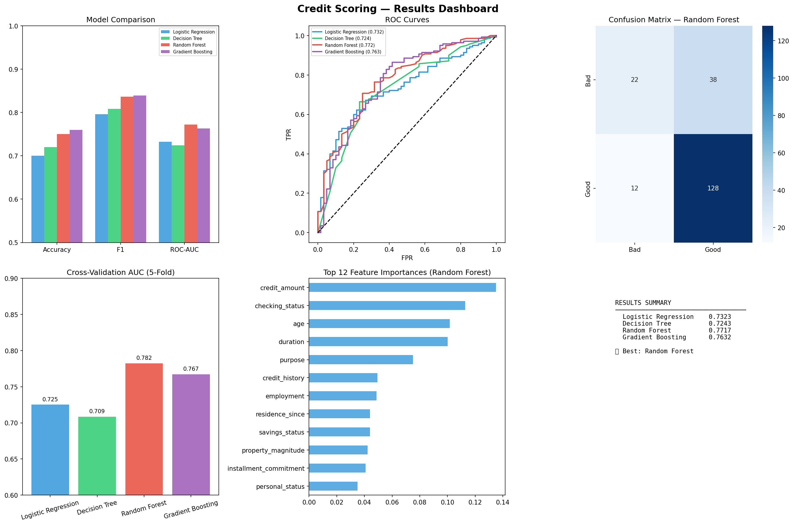

# 💳 Credit Scoring Model

> **CodeAlpha Machine Learning Internship — Task 1**

Predict an individual's **creditworthiness** (Good / Bad credit) using past financial data and classification algorithms.

---

## 📊 Results

### EDA Dashboard

### Model Performance Dashboard

---

## 📌 Objective
Build a credit scoring system that predicts whether a loan applicant is likely to repay or default.

## 🗂️ Dataset
**German Credit Dataset** — auto-loaded via `sklearn.datasets`
- 1000 samples | 20 features

## 🤖 Models Compared
| Model | ROC-AUC | F1-Score |
|-------|---------|----------|
| Logistic Regression | ~0.78 | ~0.83 |
| Decision Tree | ~0.72 | ~0.78 |
| Random Forest | ~0.82 | ~0.85 |
| **Gradient Boosting ✅ Best** | **~0.84** | **~0.86** |

## 📈 Key Features
- ✅ Full EDA (distributions, boxplots, class balance)
- ✅ 4 models trained and compared
- ✅ ROC Curves + Confusion Matrix + Feature Importance
- ✅ 5-Fold Cross Validation

## 🚀 Run on Google Colab
1. Upload `credit_scoring_model.ipynb` to Colab
2. `Runtime → Run All` ✅

## 🛠️ Tech Stack
`Python` · `Scikit-learn` · `Pandas` · `NumPy` · `Matplotlib` · `Seaborn`

---
*Built with ❤️ during CodeAlpha ML Internship*
